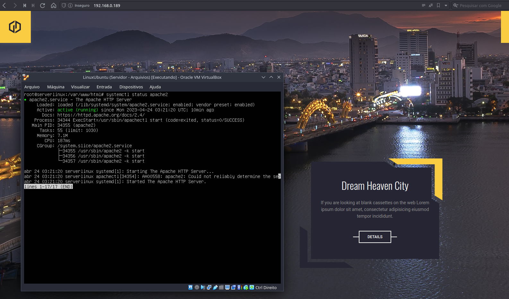

# Linux Projeto - IaC

## Desafio: Repositório do segundo projeto do curso de Linux da DIO Boot Camp AWS

Criação de um script de configuração usando os principios de Infraestrutura como código IaC. Objetivo criação de um servidor WEB Apache

## O que é Infraestrura como código? 

Infraestrutura como código (IaC) refere-se ao gerenciamento e provisionamento da infraestrutura por meio de códigos, em vez de processos manuais. A sigla vem do termo em inglês, "Infrastructure as Code".

Nesta abordagem, arquivos de configuração que incluem as especificações da sua infraestrutura são criados, facilitando a edição e a distribuição das suas configurações. A IaC também assegura o provisionamento do mesmo ambiente, todas as vezes. Ao codificar e documentar as especificações de configuração, a IaC auxilia no gerenciamento de configuração e ajuda a evitar alterações de configuração ad-hoc não documentadas.

O controle de versão é uma parte importante da IaC. Os arquivos de configuração devem pertencer à fonte como qualquer outro código-fonte de software. Ao implantar a infraestrutura como código, também é possível separá-la em módulos, que podem ser combinados de diferentes maneiras por meio da automação.

[Fonte](https://www.redhat.com/pt-br/topics/automation/what-is-infrastructure-as-code-iac/)

## Tecnologias

* SO Gnu Linux
* Shell Script
* Apache
* GitHub

## Resultado Projeto

Servidor WEB rodando no servidor no Virtual Box e aplicação rodando no browser de uma máquina na rede

## Instrutor(a)

Denilson Bonatti
Tech Lead, Digital Innovation One

## Entidade

[Digital Inovation one](https://web.dio.me)

## Autor
Edson souza

[Linkedin](https://www.linkedin.com/in/edsonfrs/)
[GitHub](https://github.com/Edsonfrs)
